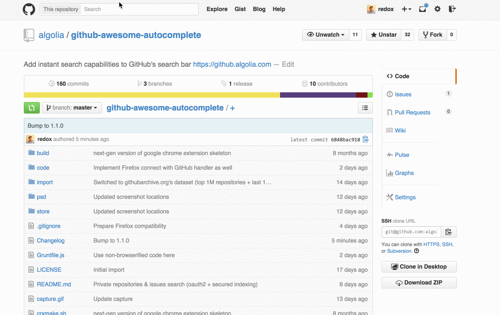
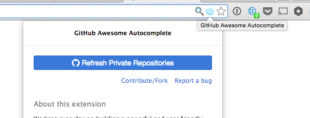

# Awesome Autocomplete

At [Algolia](https://www.algolia.com), we're git *addicts* and love using GitHub to store every single idea or project we work on. We use it both for our private and public repositories ([12 API clients](https://www.algolia.com/doc/apiclients), [HN Search](https://github.com/algolia/hn-search) or various [d](https://github.com/algolia/instant-search-demo) [e](https://github.com/algolia/facebook-search) [m](https://github.com/algolia/linkedin-search) [o](https://github.com/algolia/meetup-search) [s](https://github.com/algolia/twitter-search)).

When you work on a instant-search engine all day long, not having relevant results after a few letters in a searchbar starts making you crazy. Chrome's [Omnibox](https://support.google.com/chrome/answer/95440) works pretty well but at the end navigation in a website should not be your browser's responsibility... So we did an [Algolia-powered Chrome extension](https://chrome.google.com/webstore/detail/github-awesome-autocomple/djkfdjpoelphhdclfjhnffmnlnoknfnd) :)

### Installation

Install it from the [Chrome Web Store](https://chrome.google.com/webstore/detail/github-awesome-autocomple/djkfdjpoelphhdclfjhnffmnlnoknfnd).

### Features

This Chrome extension replaces GitHub's searchbar and add auto-completion capabilities on:

 * top public repositories
 * last active users
 * your private repositories (this one is done locally without Algolia: your list of private repositories remains locally in your browser)



### How does it work?

 * We continuously retrieve most watched repositories and last active users using [GitHub Archive](http://www.githubarchive.org/) dataset
 * Users and repositories are stored in 2 [Algolia](https://www.algolia.com/) indices: `users` and `repositories`
 * The results are fetched using [Algolia's JavaScript API client](https://github.com/algolia/algoliasearch-client-js)
 * The UI uses Twitter's [typeahead.js](http://twitter.github.io/typeahead.js/) library to display the auto-completion menu

### FAQ

#### Why can't I find a public repository?

For now, we only index the most "popular" (most watches) repositories.

#### Why can't I find a user?

For now, we only index the last active (most recent public events) users.

#### Are my private repositories sent somewhere?

**NO**, your list of private repositories remains in your local storage.

#### Is the extension collecting my private data?

**NO**, the extension doesn't collect any of your private data. Your private data remains in your browser and you'll only use Algolia's API to search for public repositories and users.

#### I've just created a new private repository, why is it not searchable?

You need to refresh your local list of private repositories:



## Development

### Installation

```sh
$ git clone https://github.com/algolia/chrome-awesome-autocomplete.git

# in case you don't have Grunt yet
$ sudo npm install -g grunt-cli
```

### Build instructions

```sh
$ cd chrome-awesome-autocomplete

# install dependencies
$ npm install

# generate your private key
$ openssl genrsa 2048 | openssl pkcs8 -topk8 -nocrypt > mykey.pem

# build it
$ grunt
```

When developing, write unit-tests, use `test-cont` Grunt task to check that your JS code passes linting tests and unit-tests.

When ready to try out the extension in the browser, use default Grunt task to build it. In `build` directory you'll find develop version of the extension in `unpacked-dev` subdirectory (with source maps), and production (uglified) version in `unpacked-prod` directory. The `.crx` packed version is created from `unpacked-prod` sources.

### Grunt tasks

* `clean`: clean `build` directory
* `test`: JS-lint and mocha test, single run
* `test-cont`: continuos `test` loop
* default: `clean`, `test`, build step (copy all necessary files to `build`
  directory, browserify JS sources, prepare production version (using uglify),
  pack the `crx` (using official shell script), and copy the resulting `crx` to
  CircleCI artifacts directory (only when on CircleCI))

